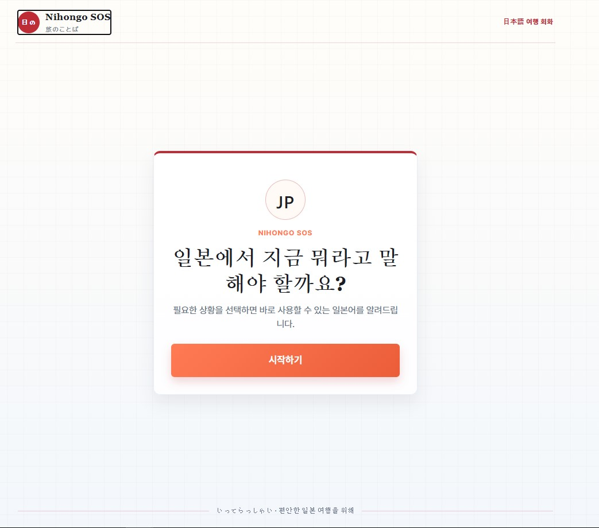
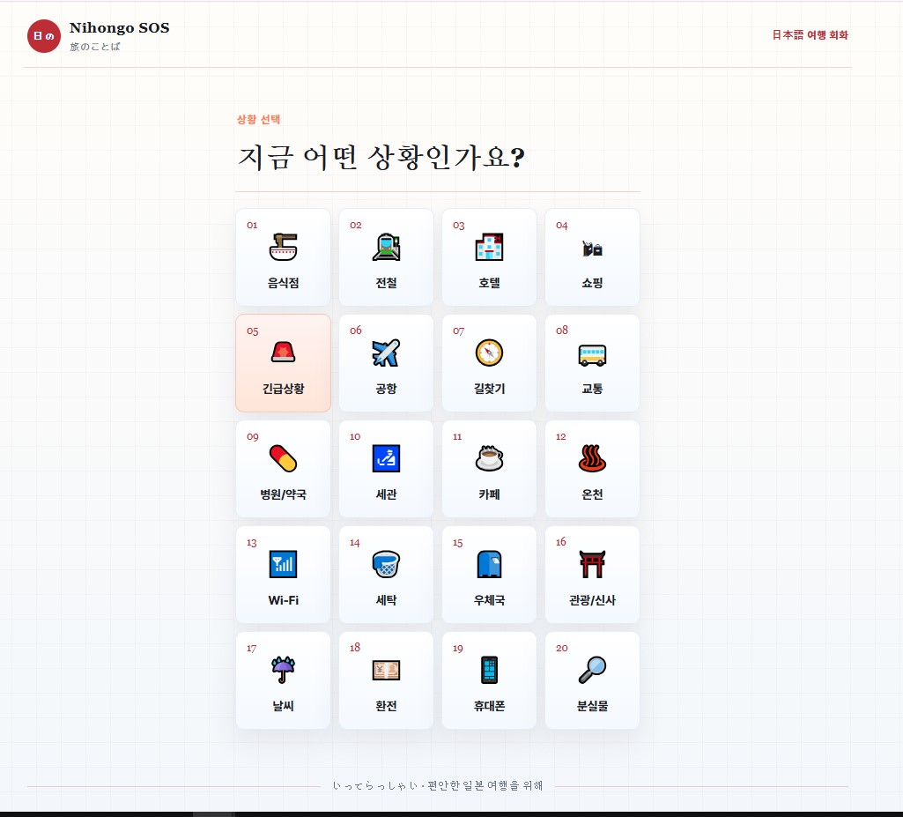
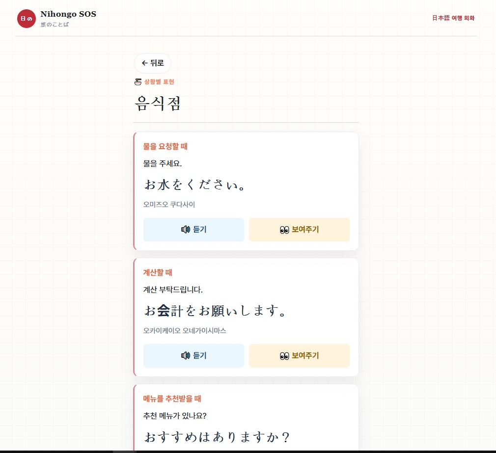

# Nihongo SOS

일본 여행 중 바로 꺼내 쓸 수 있는 상황별 일본어 회화 서비스입니다. 음식점, 교통, 호텔, 긴급상황 등 여행에서 자주 마주치는 상황을 선택하면 한국어 뜻과 일본어 표현, 발음, 음성 듣기 기능을 확인할 수 있습니다.

## 주요 기능

- 20개 여행 상황 선택
- 상황별 일본어 표현 목록 제공
- 한국어 뜻, 일본어 문장, 한글 발음 표시
- 브라우저 기본 음성으로 일본어 듣기
- 문장을 크게 보여주는 발표/대화용 화면
- 모바일 화면 대응
- 일본 여행 분위기의 헤더, 푸터, 배경 스타일

## 화면 미리보기

### 홈 화면



### 상황 선택



### 표현 목록



## 실행 방법

Node.js가 설치되어 있어야 합니다.

```bash
cd 07_team
npm install
npm run dev
```

실행 후 브라우저에서 `http://localhost:5173`을 엽니다.

배포용 빌드는 다음 명령으로 확인할 수 있습니다.

```bash
npm run build
```

## 화면 흐름

```text
홈
	-> 상황 선택
	-> 상황별 표현 목록
	-> 표현 크게 보기
```

표현 목록에서 `듣기`를 누르면 브라우저의 `SpeechSynthesis API`가 일본어(`ja-JP`)로 문장을 읽습니다. 사용 중인 브라우저와 운영체제에 일본어 음성이 설치되어 있어야 가장 자연스럽게 재생됩니다.

## 프로젝트 구조

```text
07_team/
├─ src/
│  ├─ App.jsx                 # 화면 흐름과 사용자 인터랙션
│  ├─ data/
│  │  ├─ categories.js        # 20개 상황 이름과 아이콘
│  │  └─ phrases.js           # 상황별 일본어 표현 데이터
│  └─ styles/
│     ├─ global.css           # 전역 색상, 배경, 기본 스타일
│     └─ app.css              # 화면별 UI 스타일
├─ index.html
├─ package.json
└─ vite.config.js
```

## 데이터 형식

표현 데이터는 다음 필드명을 사용합니다.

```js
{
	id: 1,
	category: "restaurant",
	situation: "물을 요청할 때",
	korean: "물을 주세요.",
	japanese: "お水をください。",
	pronunciation: "오미즈오 쿠다사이"
}
```

카테고리 값은 화면과 데이터에서 동일하게 사용해야 합니다.

```text
restaurant, train, hotel, shopping, emergency,
airport, directions, transport, medical, customs,
cafe, onsen, wifi, laundry, post, temple, weather,
money, phone, lostfound
```

## 팀 작업 참고

- 작업 폴더: `07_team`
- 기본 브랜치: `main`
- GitHub: https://github.com/kh-thejoeun-hackathon/07_team
- `node_modules`, `dist` 등 생성 파일은 Git에 커밋하지 않습니다.
